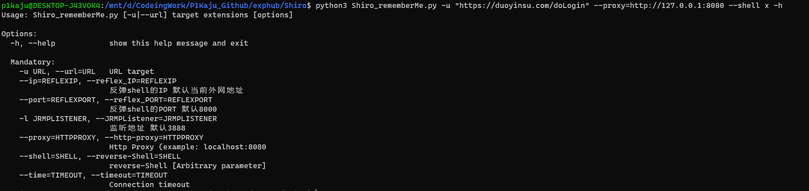

### 使用方法

~~~
Usage: Shiro_rememberMe.py [-u|--url] target extensions [options]

Options:
  -h, --help            show this help message and exit

  Mandatory:
    -u URL, --url=URL   URL target
    --ip=REFLEXIP, --reflex_IP=REFLEXIP
                        反弹shell的IP 默认当前外网地址
    --port=REFLEXPORT, --reflex_PORT=REFLEXPORT
                        反弹shell的PORT 默认8000
    -l JRMPLISTENER, --JRMPListener=JRMPLISTENER
                        监听地址 默认3888
    --proxy=HTTPPROXY, --http-proxy=HTTPPROXY
                        Http Proxy (example: localhost:8080
    --shell=SHELL, --reverse-Shell=SHELL
                        reverse-Shell [Arbitrary parameter]
    --time=TIMEOUT, --timeout=TIMEOUT
                        Connection timeout
~~~

