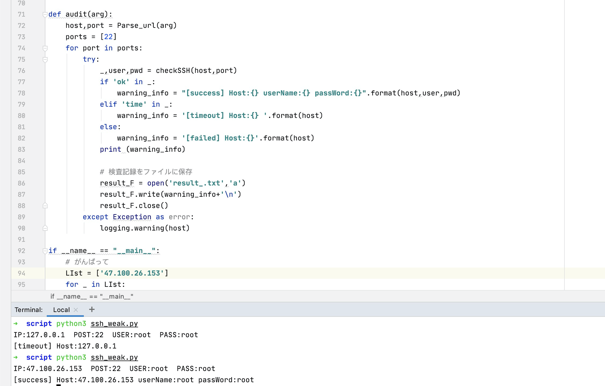

# 利用プラン


<p>&nbsp;</p><p>&nbsp;</p>

<p align="center"><strong>ssh 弱密码检测工具</strong> 簡単で便利 ♥.</p>

<p>&nbsp;</p>

```
1、setup paramiko
pip install paramiko

2、running
python2 or python3

python ssh_weak.py
```


```
チェックが必要なアカウントのパスワード
def PassDir():
    username = ['root',]
    password = ['root','123456','qwer1234']
    ......
```

```
if __name__ == "__main__":
    # がんばって
    LIst = ['127.0.0.1']
    for _ in LIst:
        audit(_)

    # ファイルタイプのアセットをロードする必要があるかどうかを選択してください 👇
    # _ = open('資産.txt','r')
    # for i in _.readlines():
    #     audit(i)
```

